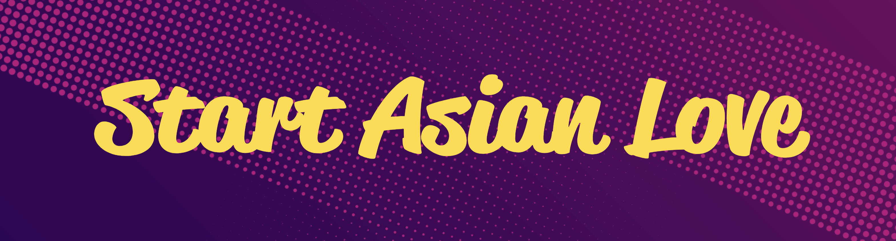

<!-- 

*** NOTES ***

• All Github READMEs use Markdown formatting: https://guides.github.com/features/mastering-markdown/

• Youtube Resource A: https://youtu.be/OoncKvcfs0M

• Youtube Resource B (Part 1): https://youtu.be/ECuqb5Tv9qI

• Youtube Resource B (Part 2): https://youtu.be/n6d4KHSKqGk

• The gradient/aurora aesthetic and clean bulleted list were inspired by Ava's github profile: https://github.com/amxchang

• The particle banner and gradient stats were inspired by Adam Alston's github profile: https://github.com/adamalston

• The color tech badges were inspired by Thomas Guibert's github profile: https://github.com/thmsgbrt

• Ava's, Adam's, and Thomas' github profiles are in this curated list of Github Profiles: https://awesomegithubprofile.tech/

• The README is not importing the stylesheet.

-->

<!-- 

*** NAME BANNER ***

• Created with tsParticles: https://particles.js.org/ 

• Recorded a 9 second demo of the particle effect.

• Converted demo video into a GIF with GIPHY Capture: https://apps.apple.com/us/app/giphy-capture-the-gif-maker/id668208984?mt=12

• Resized GIF to be under 10MB (the size limit of GIF files for Github READMEs)

• Blog Resource 1: https://josephcardillo.medium.com/how-to-add-gifs-to-your-github-readme-89c74da2ce47

• Blog Resource 2: https://dev.to/kelli/demo-your-app-in-your-github-readme-with-an-animated-gif-2o3c

• Github Emoji Cheat Sheet 1: https://github.com/ikatyang/emoji-cheat-sheet/blob/master/README.md

• Github Emoji Cheat Sheet 2: https://gist.github.com/rxaviers/7360908

 -->

<!-- 

*** SECTION HEADERS ***

• Created with Adobe Photoshop.

• Light gray color for text so they would also show up in dark mode.

• Text layers had transparent background layer and saved in PNG format.

• Each text header was cropped with the same canvas width (1555 pixels), making them responsive when uploaded into the README.

• Alternative to Photoshop: https://www.canva.com/

 -->

🔴 &nbsp;My pronouns are  **he** / **him** / **his**

🟠 &nbsp;I'm looking for help with **Algorithms**.

🟡 &nbsp;I'm currently working on <a href="https://github.com/emjose/one-hundred/#header">#100DaysOfCode.</a>

🟢 &nbsp;I'm currently learning **C#** & **Agile Methodology**. 

🔵 &nbsp;Ask me about dogs, playing cards, and paper-cut art.

🟣 &nbsp;Fun Fact: Whoopi Goldberg and Jessica Lange own my art. 

# 

<!-- 

*** BIO SECTION ***

• A single hashtag symbol (#) with an empty line above and below the symbol transforms into a horizontal break line between sections.

• The HTML code / HTML entity for a non-breaking blank space character is &nbsp; (see color circles above)

• HTML entities: https://www.w3schools.com/html/html_entities.asp#:~:text=A%20commonly%20used%20entity%20in,break%20into%20a%20new%20line).

-->

<!-- 

 -->

 

<a href="https://mod2-pets.herokuapp.com/"> <a href="https://youtu.be/-SWHzutVxBE"> <a href="https://youtu.be/6e17LUQb2Dk"> <a href="https://youtu.be/qo_YDasFpkM"> <a href="https://youtu.be/mg_Df1Qtm3A"> <a href="https://bit.ly/startasianlove">
<!-- &logo=heroku%logoColor, initial width: 100 -->
#

<!-- 

*** PROJECT DEMO SECTION ***

• The Markdown Badge Cheat Sheet: https://github.com/Ileriayo/markdown-badges

• Generating custom Markdown Badges: https://shields.io/

• Logos and Hex color values for over 1800 brands: https://simpleicons.org/

• If height and width attributes are added to the badge code, it will stretch/squeeze the logo word depending on its length.

• The 6-digit Hex color value should be placed right after "%23" - For example, see "CozyNation-%23430098" in code below.

PARSED PROJECT DEMO BADGES

<a href="https://mod2-pets.herokuapp.com/"> 

<a href="https://youtu.be/-SWHzutVxBE"> 

<a href="https://youtu.be/6e17LUQb2Dk"> 

<a href="https://youtu.be/qo_YDasFpkM">

-->

<!-- 

 -->

 

<a href="https://www.emmanuel-jose.com"> <a href="mailto:emjose@gmail.com"> <a href="https://www.instagram.com/emmanuel_jose/"> <a href="https://emmanueljose.medium.com/"> <a href="https://www.linkedin.com/in/emmanuelpjose/">  

#

<!-- 

*** PORTFOLIO & SOCIAL SECTION (formerly lets-connect section) ***

• The Markdown Badge Cheat Sheet: https://github.com/Ileriayo/markdown-badges

• Generating custom Markdown Badges: https://shields.io/

• Logos and Hex color values for over 1800 brands: https://simpleicons.org/

• If height and width attributes are added to the badge code, it will stretch/squeeze the logo word depending on its length.

• The 6-digit Hex color value should be placed right after "%23" - For example, see "youtube-%23FF0000" in code below.

PARSED SOCIAL MEDIA BADGES

<a href="https://www.youtube.com/channel/UCQdqFg-_J83jn9xJRd1W3tQ/videos"> 

<a href="mailto:emjose@gmail.com"> 

<a href="https://www.instagram.com/emmanuel_jose/"> 

<a href="https://emmanueljose.medium.com/"> 

<a href="https://www.linkedin.com/in/emmanuelpjose/"> 

-->

<!-- 

 -->

 

  

#

<!-- 

*** GITHUB STATS SECTION ***

• Generating your custom Github stats: https://github.com/anuraghazra/github-readme-stats

• Blog Resource: https://towardsdatascience.com/build-a-stunning-readme-for-your-github-profile-9b80434fe5d7

• Height and width values for the stats cards should be even, not odd. Oddly, odd values did not work for me.

PARSED GITHUB STATS CARDS

 

-->

<!-- 

 -->

     
          

<!-- initial width: 100 -->
<!-- 

*** TECHNOLOGIES SECTION ***

• The Markdown Badge Cheat Sheet: https://github.com/Ileriayo/markdown-badges

• Generating custom Markdown Badges: https://shields.io/

• Icon Resource 1: https://devicon.dev/

• Icon Resouce 2: https://icongr.am/devicon

• Logos and Hex color values for over 1800 brands: https://simpleicons.org/

• If height and width attributes are added to the badge code, it will stretch/squeeze the logo word depending on its length.

• The 6-digit Hex color value should be placed right after "%23" - For example, see "rails%20-%23CC0000" in code below.

PARSED TECHNOLOGIES BADGES

 

 

  

 

 

 

 

 

 

 

 

-->

<!-- 

• My personal badges were "Ruby, Rails, JavaScript, React, Redux, Photoshop, Lightroom, PostgreSQL, SQL, Github/Git, Semantic UI, SQLite, CSS" 

• I omitted Semantic UI to have even number of badges (better aesthetic when resized).

-->

<!-- 

*** Alternative Two-Tone Badge Style ***

 

 

 

-->

<!-- 

*** COMPREHENSIVE LIST OF GITHUB PROFILE README RESOURCES ***

https://github.com/abhisheknaiidu/awesome-github-profile-readme/#tools

-->

#

<a href="https://emjose.github.io/quote-generator/"> <a href="https://emjose.github.io/color-flipper/"> <a href="https://emjose.github.io/progress-bar/"> <a href="https://emjose.github.io/expand-search-one/"> <a href="https://emjose.github.io/expand-search-two/"> <a href="https://emjose.github.io/expanding-cards/"> <a href="https://emjose.github.io/blurry-loading/"> <a href="https://emjose.github.io/password-strength-background/"> <a href="https://emjose.github.io/kinetic-loader-1/"> <a href="https://emjose.github.io/kinetic-loader-2/"> <a href="https://emjose.github.io/analog-clock-1/"> <a href="https://emjose.github.io/analog-clock-2/"> <a href="https://emjose.github.io/vertical-cards/"> <a href="https://emjose.github.io/coffee-counter/"> <a href="https://emjose.github.io/range-slider/"> <a href="https://emjose.github.io/block-animation/"> <a href="https://emjose.github.io/heart-animation/"> <a href="https://emjose.github.io/opening-crawl/"> <a href="https://emjose.github.io/form-validation/"> <a href="https://emjose.github.io/parallax-background/"> <a href="https://emjose.github.io/video-scroll-one/"> <a href="https://emjose.github.io/video-scroll-two/"> <a href="https://emjose.github.io/parallax-scroll/"> <a href="https://emjose.github.io/split-landing-page/"> <a href="https://emjose.github.io/calculator-react/"> <a href="https://emjose.github.io/calculator-vuejs/"> <a href="https://emjose.github.io/calculator-tilt/"> <a href="https://emjose.github.io/kboard/"> <a href="https://emjose.github.io/slingshot/"> <a href="https://emjose.github.io/toast-notifications/"> <a href="https://emjose.github.io/budapest-calendar/"> <a href="https://emjose.github.io/mousetrail-particle1/"> <a href="https://emjose.github.io/mousetrail-particle2/"> <a href="https://emjose.github.io/mousetrail-particle3/"> <a href="https://emjose.github.io/mousetrail-particle4/"> <a href="https://emjose.github.io/mousetrail-space/"> <a href="https://emjose.github.io/mousetrail-wandavision/"> <a href="https://emjose.github.io/model-minority-myth/"> <a href="https://news-site-emjose.vercel.app/"> <a href="https://crypto-tracker-emjose.vercel.app/"> <a href="https://global-metrics-app.vercel.app/">
<!-- initial width: 79 -->
 

<a href="https://github.com/emjose/one-hundred/#header"> 

<!-- 

<a href=""> -->

<!-- placeholder section -->

<!-- 

*** #100DAYSOFCODE BADGE TEMPLATE ***

<a href="">

<a href="">

<a href="">

<a href="">

<a href="">

<a href="">

<a href="">

<a href="">

<a href="">

<a href=""> -->

#

 

🟣 &nbsp;A collaborative site to amplify Asian voices and provide **#StopAsianHate** resources. 

🟣 &nbsp;Start Asian Love [Repo](https://github.com/wlcreate/Start-Asian-Love) and [Live Site](https://bit.ly/startasianlove).

#

 

🔴 &nbsp;[My blog on how I created my Github READMEs](https://emmanueljose.medium.com/readme-a-makeover-story-b9c7be37a6de?sk=7ae6623d365409d875753e4604e42ffd) 

🔴 &nbsp;[Comprehensive List of Github Profile README Resources](https://github.com/abhisheknaiidu/awesome-github-profile-readme/#tools) 